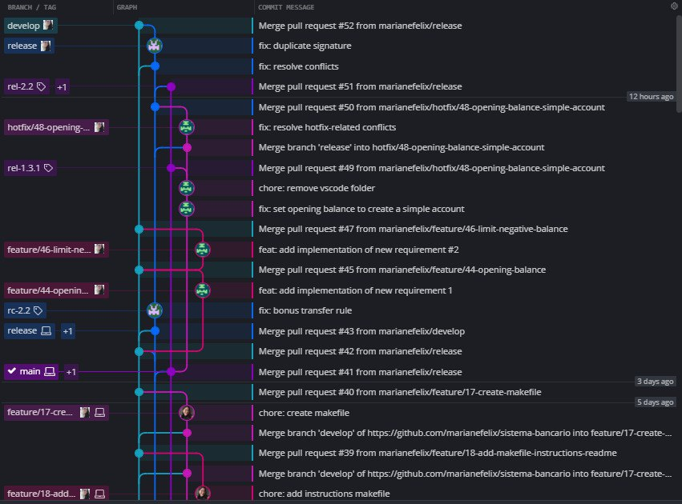
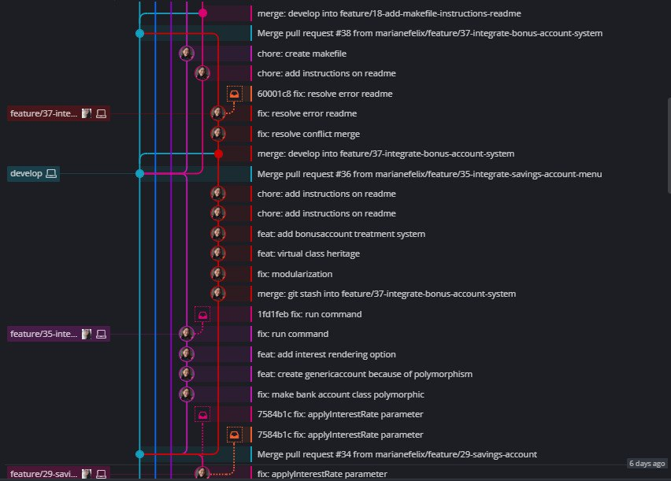
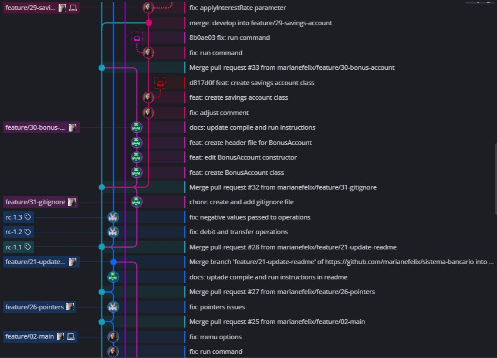
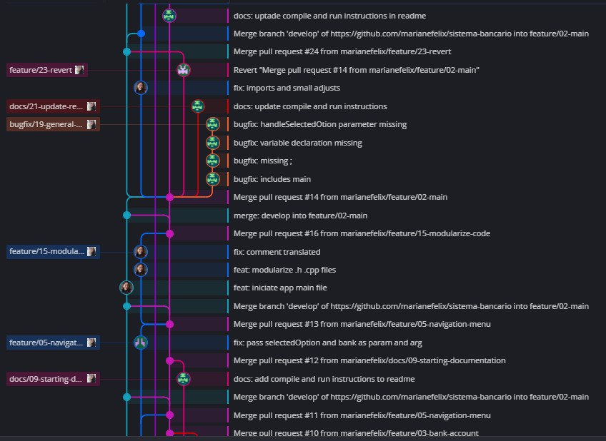
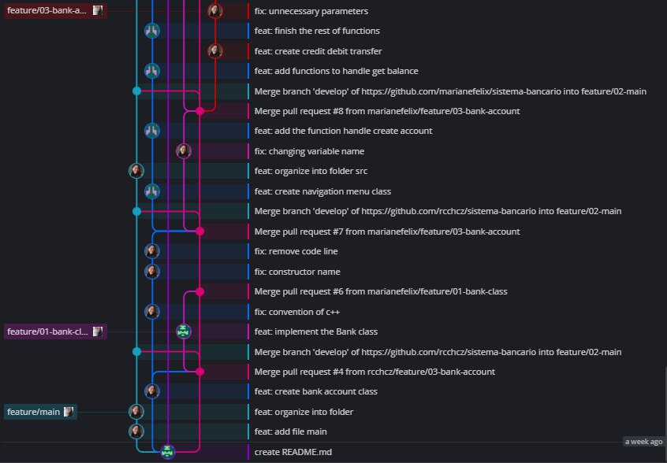

# Banking system
This system simulates a simple bank. The main purpose of this repository is to practice studies in configuration and change management.

 

# Project informations
- Workflow: **`GitFlow`**

- We use a commit pattern that can be found here: [**Conventional Commits**](https://www.conventionalcommits.org/en/v1.0.0/)

- Here is an image of the code tree built by **GitKraken**:

 

 
 

# APP
### **Compile and run with Makefile**
If your operating system is **`Windows`**, you must have MinGW installed.
If not, please install it.
If you do, follow the next steps to run the system:
- Be in the root folder of the project
- In the terminal, run the command:
> $ `mingw32-make`
- In the terminal, run the command:
> $ `./bankapp`
- The application will be running.

 

If your operating system is **`Linux`**, you only need to follow these steps:
- Be in the project root folder
- In the terminal, run the command:
> $ `make`
- In the terminal, run the command:
> $ `./bankapp`
- The application will be running.

 

### **Compile and run without using Makefile**
From the root of the project

> $ `g++ -std=c++11 -Wall -Wextra -c src/bank_account.cpp src/savings_account.cpp src/generic_account.cpp src/bonus_account.cpp  src/bank.cpp src/navigation_menu.cpp src/main.cpp`

> $ `g++ -o bankapp bank_account.o savings_account.o generic_account.o bonus_account.o  bank.o navigation_menu.o main.o`

and then

> $ `./bankapp`

 
 

# TESTING
### **Compile and run with Makefile**
The tests implemented were unit tests for bank operations - no requests to the REST API layer.

So if your operating system is **`Windows`**, you must have MinGW installed.
If not, please install it.
If you do, follow the next steps to run the tests:
- Access the "tests" folder that is present in the project root
> $ `cd .\tests\`
- In the terminal, run the command:
> $ `mingw32-make`
- In the terminal, run the command:
> $ `./testapp`
- The tests will be executed.

 

If your operating system is **`Linux`**, you only need to follow these steps:
- Access the "tests" folder that is present in the project root
> $ `cd .\tests\`
- In the terminal, run the command:
> $ `make`
- In the terminal, run the command:
> $ `./testapp`
- The tests will be executed.

 

### **Compile and run without using Makefile**
From the root of the project

> $ `g++ -std=c++11 -Wall -Wextra -c ../src/bank_account.cpp ../src/savings_account.cpp ../src/generic_account.cpp ../src/bonus_account.cpp ../src/bank.cpp test_main.cpp`

> $ `g++ -o testapp bank_account.o savings_account.o generic_account.o bonus_account.o bank.o test_main.o`

and then

> $ `./testapp`